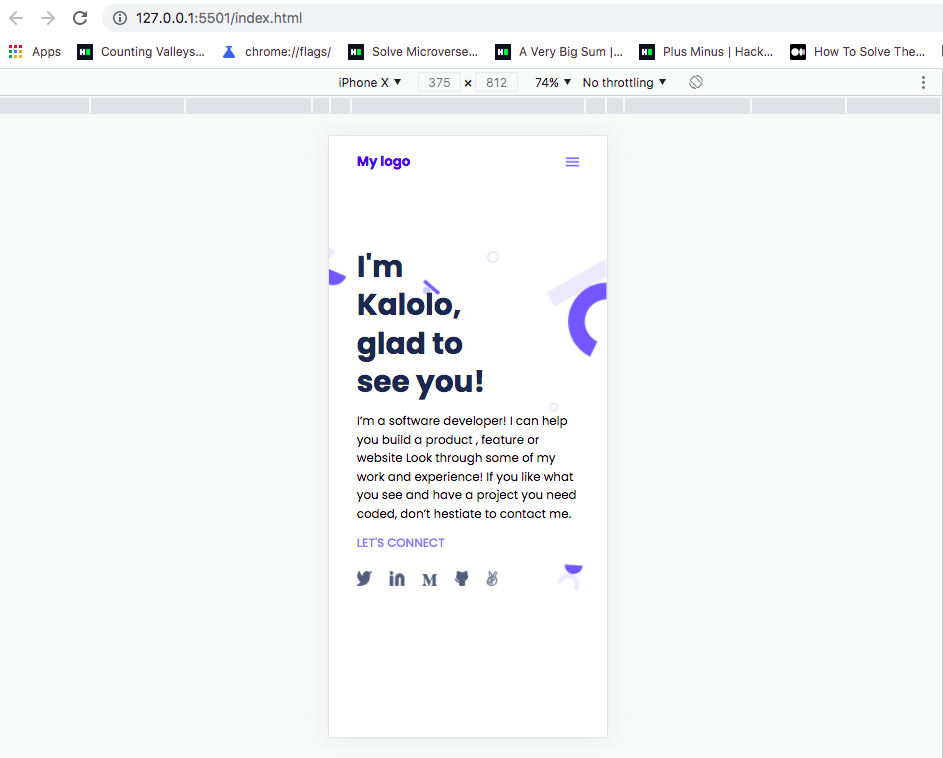

# Mobile Skeleton Project For Microverse By Kalolo Chola Lemba

> This is a simple web develoment project for microverse created using simple HTML(Hyper text mark-up Language.) and CSS(Cascading Style Sheet) which is used for styling or decorating the webpage.

Additional description about the project and its features.

## Built With

- Html
- css

## Getting Started

**Instructions on how to access my project locally.**
 To Access my project locally please follow the following instructions;
1. Enter this url: https://kaylemba.github.io/MyPortfolio2/ in your web browser.
2. Once opened navigate to the top left level of the project a green code download button will be visible on the righthand side.
3. Select download Zip option from drop down menu.
4. Once the download is complete you will be able to access my project locally.
Here is my repository link: https://Kaylemba.github.io/MyPortfolio2/

## Authors

👤 **Kalolo Chola Lemba**

- GitHub: [@githubhandle](https://github.com/KayLemba)

## 🤝 Contributing

Contributions, issues, and feature requests are welcome!

Feel free to check the [issues page](../../issues/).

## Show your support

Give a ⭐️ if you like this project!

## Acknowledgments

- Hat tip to anyone whose code was used
- Inspiration
- etc

## 📝 License

This project is [MIT](./MIT.md) licensed.
